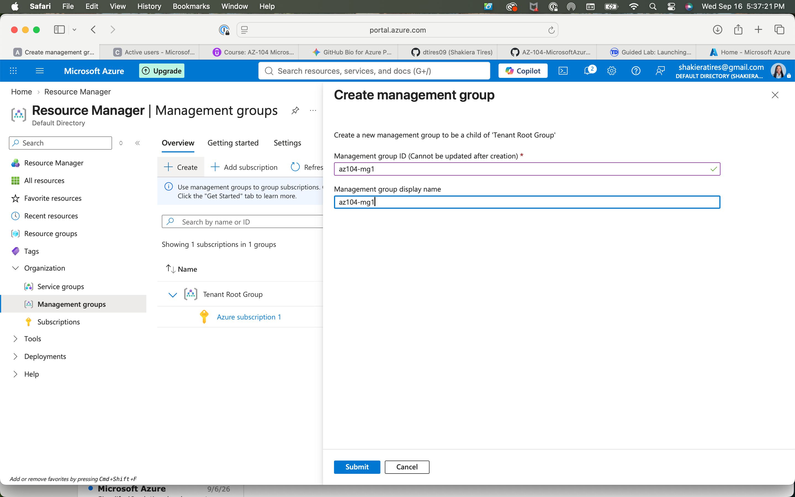
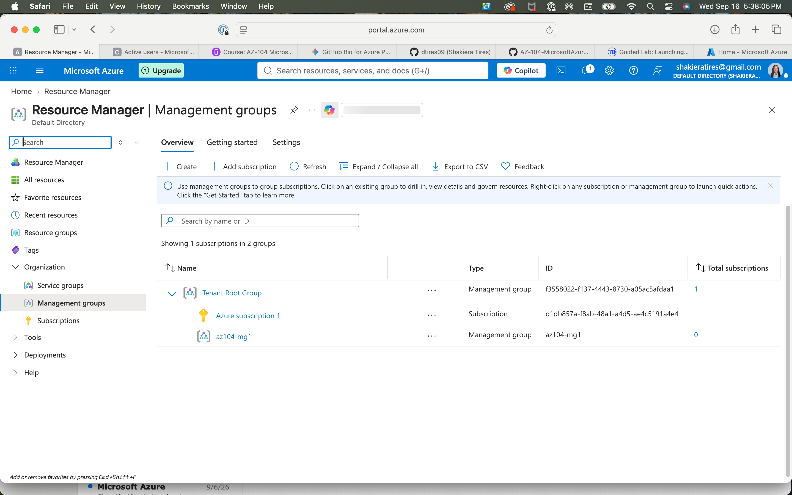
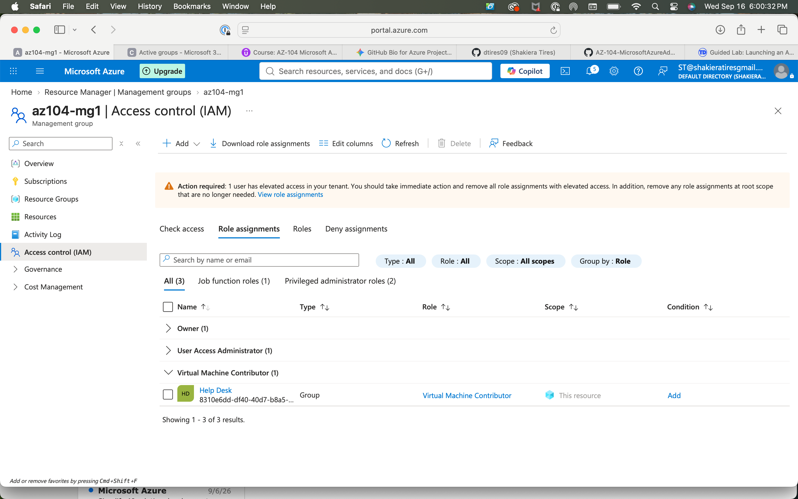
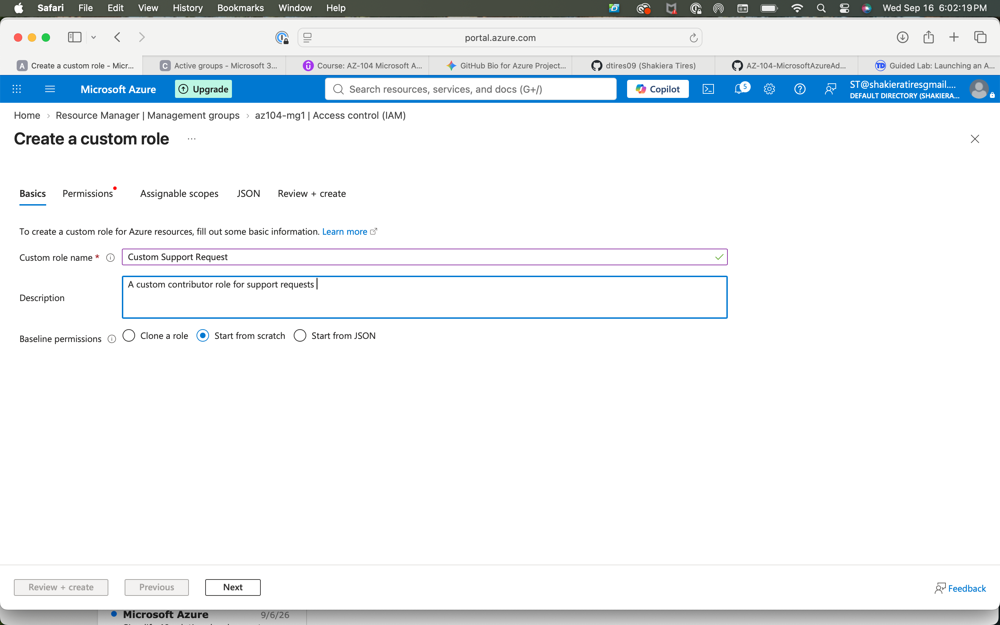
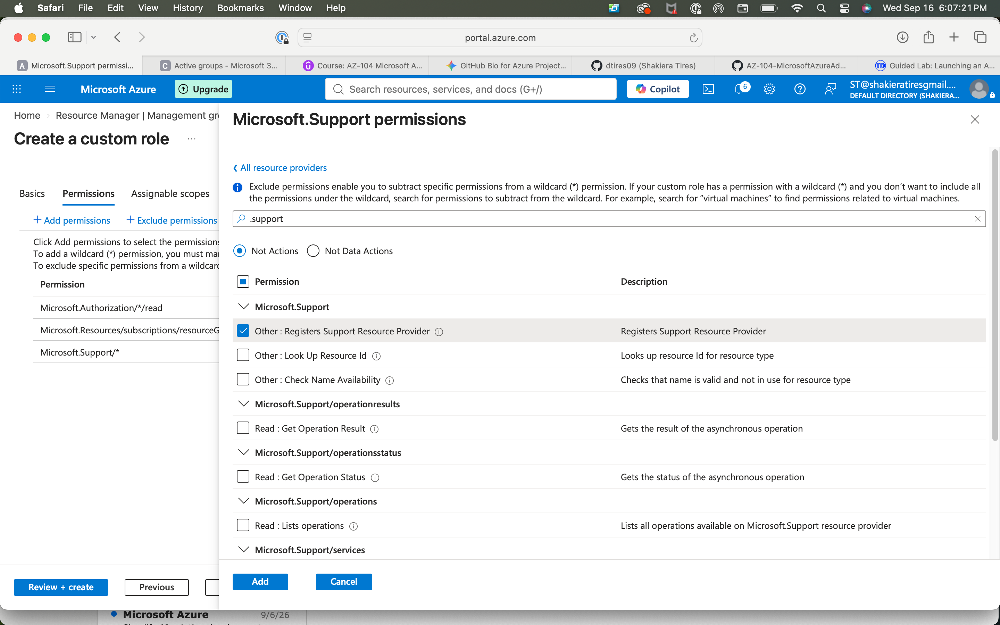
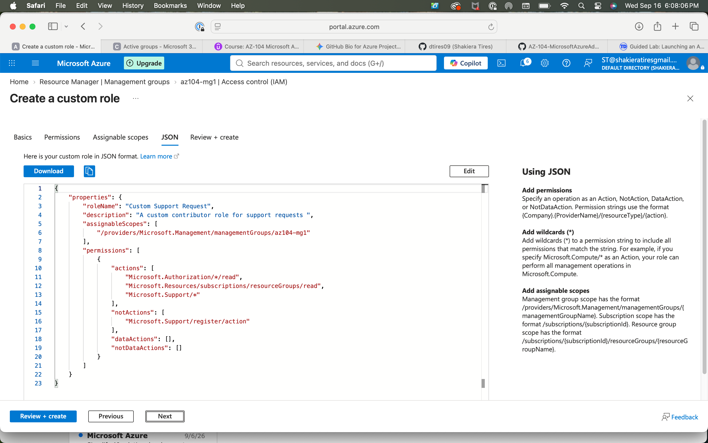
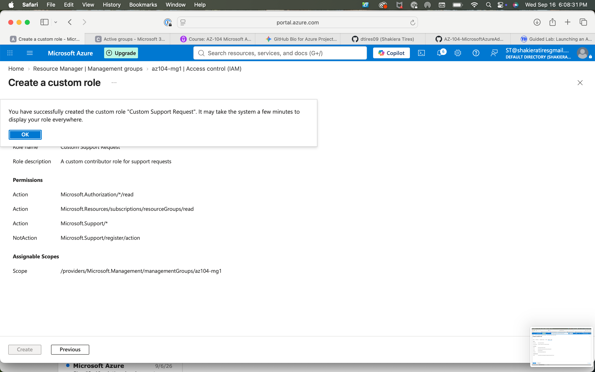

# Azure Management Groups & Role-Based Access Control (RBAC) Lab

## 🎯 Objective
Configured Azure management hierarchy structures and implemented customized Role-Based Access Control (RBAC) policies to enforce the principle of least privilege across cloud resources.

## 🛠️ Tech Stack & Concepts
* **Cloud Platform:** Microsoft Azure
* **Key Services:** Azure Resource Manager (ARM), Management Groups, Access Control (IAM), Custom Roles
* **Security Principles:** Principle of Least Privilege, Scope Inheritance, Custom JSON Permissions

---

## 📋 Implementation Walkthrough & Screenshots

### 1. Management Group Hierarchy Creation
Established a custom management group (`az104-mg1`) as a child of the Tenant Root Group to organize governance boundaries and manage subscription-level permissions at scale.
* **Creation Step:**
  
* **Verification & Deployment Success:**
  

### 2. Role Assignments & Group Management
Configured targeted role assignments at the management group scope, linking identity groups (such as the Help Desk team) with appropriate operational roles like *Virtual Machine Contributor*.
* **Help Desk Group Assignment:**
  

### 3. Custom RBAC Role Creation & JSON Configuration
Designed a specialized custom role ("Custom Support Request") starting from scratch, explicitly defining required actions while excluding unnecessary permissions to maintain strict security boundaries.
* **Role Basics & Description:**
  
* **Granular Permission Selection:**
  
* **JSON Syntax & Definitions:**
  
* **Successful Role Deployment:**
  

---

## 🚀 Key Takeaways
* Successfully deployed hierarchical management structures for streamlined cloud governance.
* Built and validated custom least-privilege roles using both the Azure Portal interface and JSON configuration templates.